<h1> HEY HERE'S HOW YOU CAN CREATE A BOT FOR HOMEWORK REMINDERS </h1>
<h2> Functions</h2>
1. Set up homework from the bot
2. Check homework on a particular date whether there is homework
   1. if so, state the homework and the time to hand up
3. <Work-in-progress> Send Reminder from the bot to class group

---

<h2>Potentials</h2>
This interface can be used on many other chat platforms and improve on.

Areas of improvement:

1. More chat platforms
2. Interactive responses
   - Currently, they are just words. Cards, pictures, voice recognition, ML and even more can be used on this!
3. More functionality
   - Currently, we use Google Calendar as Cloud Storage instead of Bucket(teehee!) May need to change for more flexibility
   - What if prof last min changes the deadline? How would we change from the bot interface? We can use interactive tools if the bot admin(not just me!) knows how to put them in
   - What if there are 10 and more homework deadlines in the day? How can we improve on the UI/UX?

As for now, it can do the basics, and I am improving the 3rd part.

<h2>To get a general knowledge on what is used...</h2>
I will be using:

1. node.js 8
2. Google Cloud Functions (Advised to use free subscription with your fake account. Will only last for 1 year. Tips on Cloud Programming 101.haha)
3. Dialogflow
4. Google Calendar APIs
5. <work-in-progress> Google Scheduler

<h2>
    Architecture
</h2>

 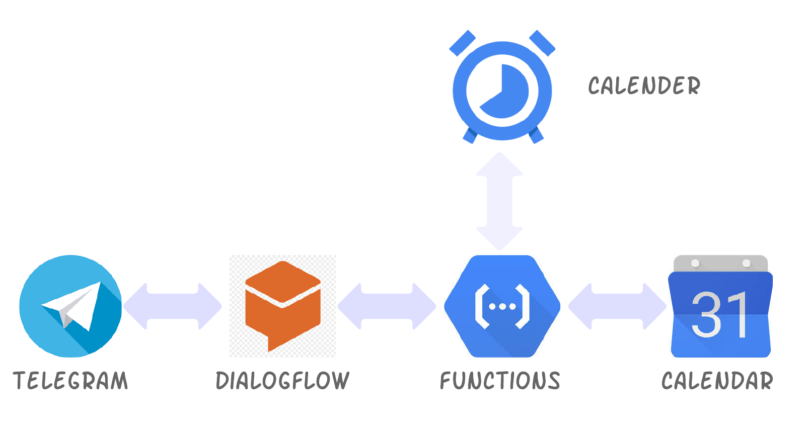

<h2>Set up </h2>
I assume that you know how to git clone since you are using GitHub.

Just in case, install [git](https:git-scm.com/downloads), and then ```git clone https://github.com/huixiang01/homework_bot.git  ``` in your command prompt

Telegram

---

1. Get Bot token from Bot Father 
   - Refer to https://www.siteguarding.com/en/how-to-get-telegram-bot-api-token
2. Save the Bot token somewhere for the last step. Don't just copy. There will be quite a lot of copying here.

---

Google Cloud

---

1. Sign up for [Google Cloud](https://console.cloud.google.com/)

2. Go to Console

3. In the Cloud Console, on the project selector page, select or create a Google Cloud project.

   [GO TO THE PROJECT SELECTOR PAGE](https://console.cloud.google.com/projectselector2/home/dashboard)

4. Make sure that billing is enabled for your Google Cloud project. [Learn how to confirm billing is enabled for your project](https://cloud.google.com/billing/docs/how-to/modify-project). Don't worry if you have put your credit card number. They will not bite if you have exceed the 1 year subscription

5. Enable the Cloud Functions API.

   [ENABLE THE API](https://console.cloud.google.com/flows/enableapi?apiid=cloudfunctions&redirect=https://cloud.google.com/functions/quickstart)

6. Enable the Cloud Calendar API.

   [ENABLE THE API](https://console.cloud.google.com/apis/library/calendar-json.googleapis.com?q=calendar&id=84f291c9-2585-4af1-a78b-09c53a78202f)

   ---

   Service Account

   ---

   1. Go to API & Services from your [console](https://console.cloud.google.com/) and click on Credentials at the left toolbar

   2. Create Service Account Key through Create Credentials dropdown bar!

      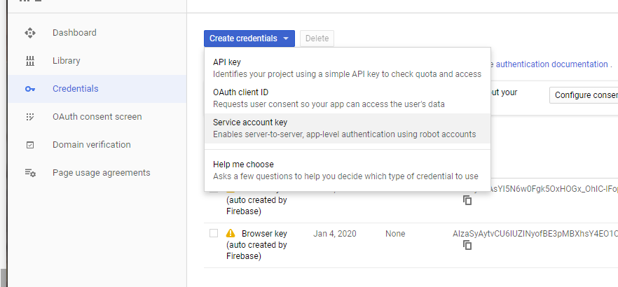

   3. Under Service Account, choose "New service account" and name your service account name

   4. Choose JSON

      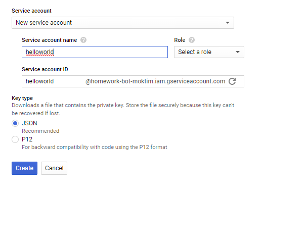

   5. Create without role

   6. Save your downloaded json in the same folder for the sake of organisation

   7. Copy service account key into bot.js

   ---

   Google Calander

   ---

   1. Go to [Google Calendar](https://calendar.google.com/) and create new Calendar 

      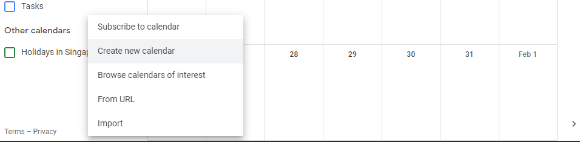

   2. Go to the new Calendar's Settings

      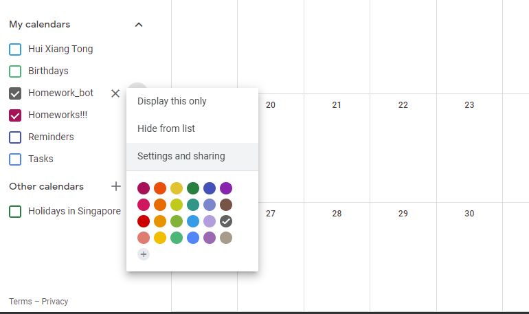

   3. Invite your bot into the calendar using the client email from the downloaded json file and set permission to make changes and manage sharing

      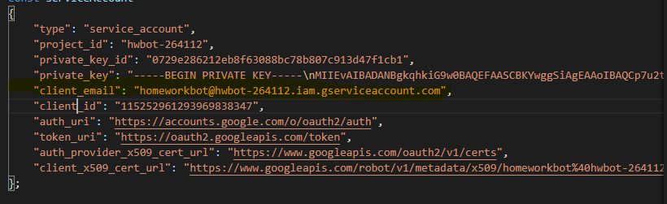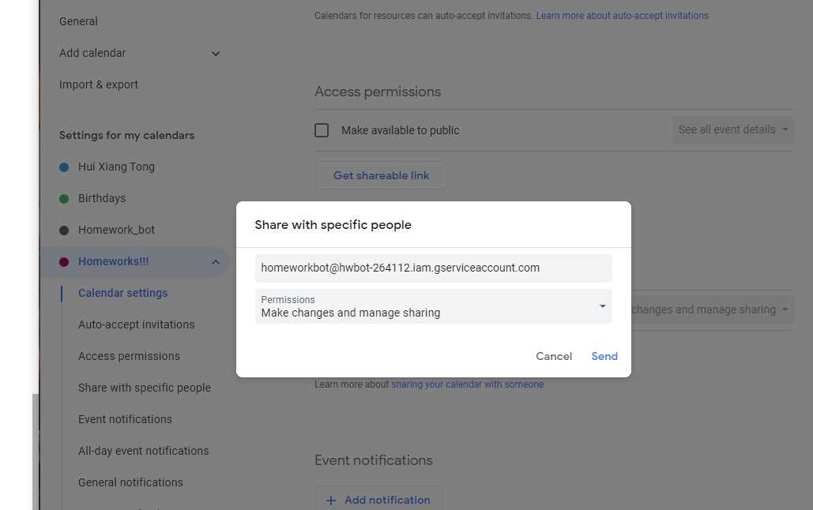

   4. Scroll down and copy the calendar id into bot.js 

      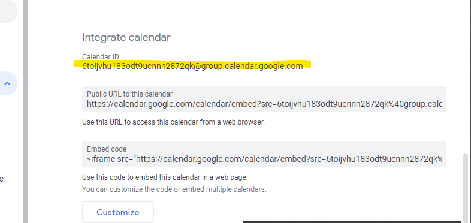

## Create a function

1. Open the Functions Overview page in the Cloud Console:

   [GO TO THE CLOUD FUNCTIONS OVERVIEW PAGE](https://console.cloud.google.com/functions/list)

   Make sure that the project for which you enabled Cloud Functions is selected.

2. Click **Create function**.

3. Name your function.

4. In the **Trigger** field, select **HTTP Trigger**.

5. In the **Source code** field, select **Inline editor**. In this exercise, you will use the default function provided in the editor. The function logs a message that you provide in a later step.

6. Use the **Runtime** dropdown to select a runtime.

   - Choose node.js 8

7. Copy and paste bot.js and package.json accordingly from the file that you have git clone earlier

8. Type 'receiveRequest' in **Function to execute**, changing from 'hello_World'

   When you finish these steps, your display should resemble something like the following:

   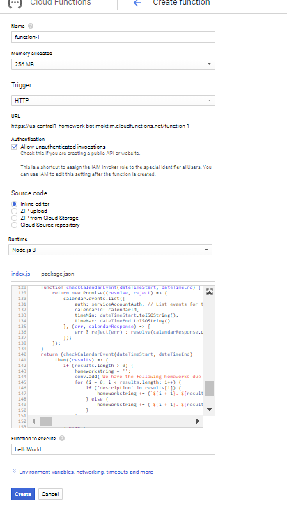

   *Ops!, I forgot to change the function to execute*

## Deploy a function

1. At the bottom of the page, click **Create**.

2. After clicking **Create**, Cloud Console redirects to the Cloud Functions Overview page.

   - While the function is being deployed, the icon next to it is a small spinner. After it finishes deploying, the spinner turns to a green check mark. You will get something like the following:

   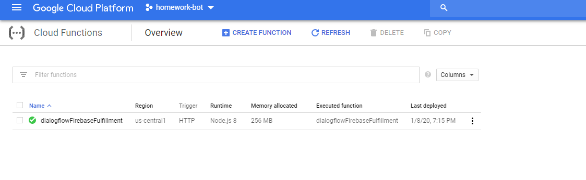

3. Click on the function, go to the trigger tab and copy and save the url somewhere. We will use it to integrate with Dialogflow. *In case you don't know, this is a webhook connecting functions and Dialogflow.*

---

<h2>Dialogflow</h2>
---

1. Once you have gotten the token, go to <a>console.dialogflow.com</a> to create the contents of your bot

2. Create your bot agent 

   - Refer to <a>https://chatbotslife.com/dialogflow-restaurant-bot-tutorial-1-45ce1d3c0ab5</a>

   - Do until step 2

3. Import the zip file in the folder 

   - Refer to https://miningbusinessdata.com/how-to-import-an-agent-zip-file-into-api-ai/

   - This contains the content of the bot. You can customise and start over again... but this takes too much time. haha

4. Integrate with telegram and functions

   1. Click **Intents** in the navigation menu of Dialogflow at the left.

   2. Click on homework-setup intent

   3. Specify reprompt phrases to speak back to users.

      **Do this with fulfillment** at the bottom of the page:

      1. Toggle **Enable webhook call for this intent** in the intent's **Fulfillment** section. 

   4. Repeat step 2 and 4 but with homework-check intent

   5. In the [Dialogflow console](https://console.dialogflow.com/)'s navigation menu, click Integration, toggle the Telegram button to **ENABLED**. Copy the token into the space given.

      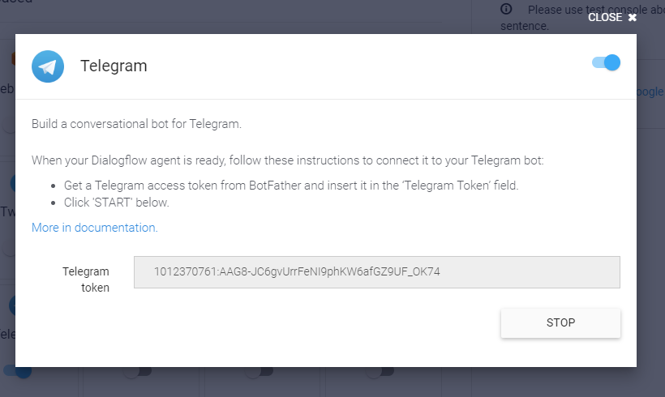

      *For your information, you can integrate with other chat application in this page. You will just need to find how to integrate them. Here, we will use telegram as an example.*

   6. Leave your tab for dialogflow open as we will be coming back here later

   7. In the [Dialogflow console](https://console.dialogflow.com/)'s navigation menu, click **Fulfillment**, toggle the **Webhook** button to **ENABLED** , and we will to replace the url in the **URL** field with your **Function URL**. Copy the url

   8. Make sure you save it at the bottom.

      

Okay! You are good to go! Finally! Enjoy Boot-ing!